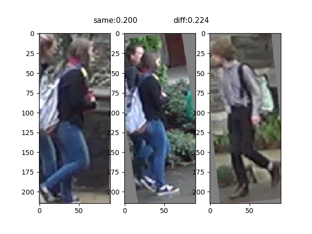
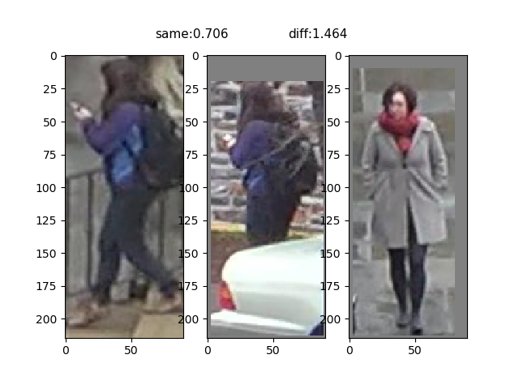
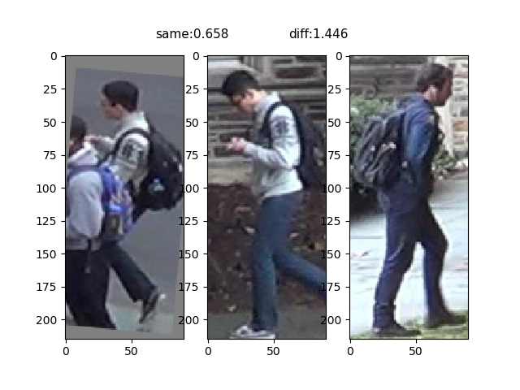

# 一个简单的reid 程序

## 训练过程展示

* 第一第二张图片为同一个人
* 第一第三为不同人
* smae 为第一第二张图片的特征距离
* diff 为第一第三张图片的特征距离
* 主干网络为MobileNetV2
* 使用 Triplet_loss 与 Softmax 共同训练
* 数据集为 DukeMTMC-reID

### 第一个周期

### 第十个周期

### 第四十个周期
